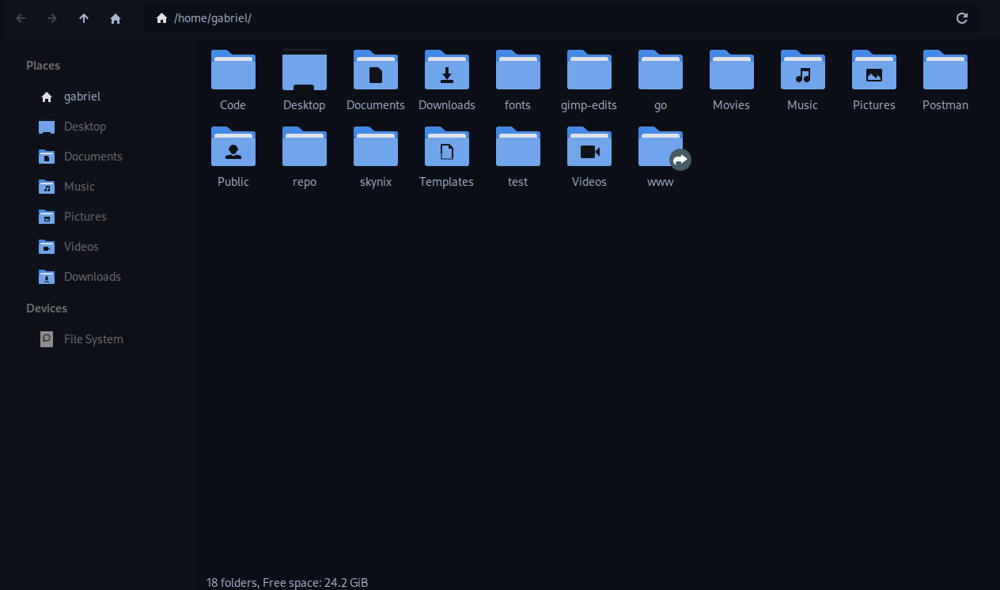
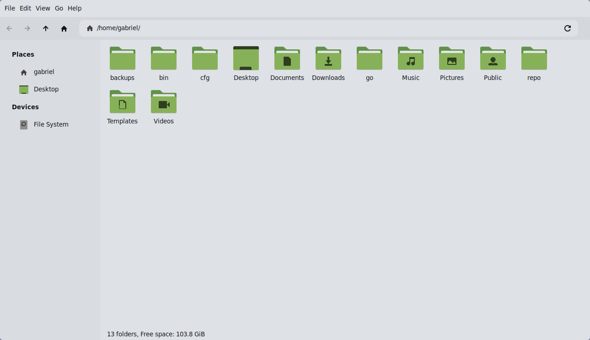

# Decay Gtk

<code>decay theme for gtk3</code> ~ this is modification of <a href="https://github.com/janleigh/gtk3">janleigh's fork</a> of elkowar's fork of phocus but using the decay palette.

## Deprecation notice

Yes, this repo will be deprecated in favor of the [decay-gtk](https://github.com/decaycs/decay-gtk) (which is a better port than this one).

## Screenshots

### Decay


### Dark Decay


### Decayce



### Light Decay


### — Installation

```sh
# First, clone the repository.
$ git clone https://github.com/decaycs/gtk3 decay-gtk3

# Then go to the decay version you want
cd decay-gtk3/decay # or decay-gtk3/dark-decay, or decay-gtk3/light-decay or decay-gtk3/decayce

# Then, install sass compiler.
$ npm install -g sass

# Compile and install the theme.
$ make && sudo make install
```

### Applying

Then set it in your `~/.config/gtk-3/settings.ini` using the `gtk-theme-name` key:

```ini
gtk-theme-name=decay # or dark_decay, or light_decay
```

### Enjoy

I hope you enjoy with this!
